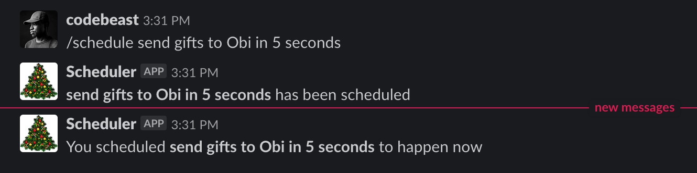

# Challenge 6: Durable Pattern

Happy St. Nicholas Day! Here in the Styrian region of Austria, it's said that today is the day that St. Nicholas goes around handing out presents, while his evil counterpart Krampus whips those who have been naughty. These days, that mostly results in people giving each other bundles of _ruten_, bundles of birch twigs that have been painted gold.

You're supposed to hang up these ruten year-round to remind children to be good, but of course today's children don't spend much more time in online chats than sitting in front of the fireplace. Let's write a reminder tool using serverless tech that lets Austrian children set reminders to do good deeds in their favorite chat app!

Build a chat integration for your favorite chat service (e.g. Discord or Slack) that lets you schedule tasks using natural language (e.g. `/schedule volunteer at the senior citizens' center tomorrow at 11:00`). You should be able to get a confirmation that your event has been scheduled, and then get a notification at the correct time.

## Resources/Tools Used 🚀

Here are some tools I recommend to help you complete this task:

| Tool                                                                                                                                                            | Description                                                  |
| --------------------------------------------------------------------------------------------------------------------------------------------------------------- | ------------------------------------------------------------ |
| [**Visual Studio Code**](https://code.visualstudio.com/?WT.mc_id=25daysofserverless-github-cxa)                                                                 | Code editor                                                  |
| [**Postman**](https://www.getpostman.com/downloads/)                                                                                                            | API testing client                                           |
| [**Azure Functions Extension**](https://marketplace.visualstudio.com/items?itemName=ms-azuretools.vscode-azurefunctions&WT.mc_id=25daysofserverless-github-cxa) | Scaffold, debug and deploy serverless functions from VS Code |
| [**Chrono**](https://github.com/wanasit/chrono)                                                                                                                 | Convert natural English language to date/time                |
| [**Moment Timezone**](https://github.com/moment/moment-timezone)                                                                                                | Handle timezones correctly from JS dates                     |

...and here are some resources to guide you:

| Resources                                                                                                                   | Description                                                     |
| --------------------------------------------------------------------------------------------------------------------------- | --------------------------------------------------------------- |
| [**Build a Slash Command**](https://api.slack.com/tutorials/slash-block-kit)                                                | Learn how to build a `/slash` command for Slack                 |
| [**Slack Incoming Webhooks**](https://api.slack.com/messaging/webhooks)                                                     | Learn what incoming message webhooks are and how to use them    |
| [**Stateful Serverless**](https://dev.to/azure/stateful-serverless-with-durable-functions-2jff)                             | Learn how to create schedules and timers with Durable Functions |
| [**Durable Contraints**](https://docs.microsoft.com/en-us/azure/azure-functions/durable/durable-functions-code-constraints) | Beware of non-deterministic functions                           |

## Getting Started 🔥

Follow this [dev.to tutorial](https://dev.to/azure/stateful-serverless-with-durable-functions-2jff) to learn how to get started with Durable functions.

## Next Steps 🏃

Learn more about serverless with a Free Training!

-   ✅ **[Serverless Free Courses](https://docs.microsoft.com/learn/browse/?term=azure%20functions&WT.mc_id=25daysofserverless-github-cxa)**

## Important Resources ⭐️

Here include all the important features related to the challenges that are integrated into microsoft.docs. Ex.:

-   ✅ **[Azure Functions documentation](https://docs.microsoft.com/azure/azure-functions/?WT.mc_id=25daysofserverless-github-cxa)**
-   ✅ **[Azure SDK for JavaScript Documentation](https://docs.microsoft.com/azure/javascript/?WT.mc_id=25daysofserverless-github-cxa)**
-   ✅ **[Create your first function using Visual Studio Code](https://docs.microsoft.com/azure/azure-functions/functions-create-first-function-vs-code?WT.mc_id=25daysofserverless-github-cxa)**
-   ✅ **[Free E-Book - Azure Serverless Computing Cookbook, Second Edition](https://azure.microsoft.com/resources/azure-serverless-computing-cookbook/?WT.mc_id=25daysofserverless-github-cxa)**

## I have doubts ... What do I do?! ❓

If you have any doubts about the challenges, feel free to open an **[ISSUE HERE](https://github.com/microsoft/25-days-of-serverless/issues)**. As soon as possible we will be answering any questions/doubts that you may have!
